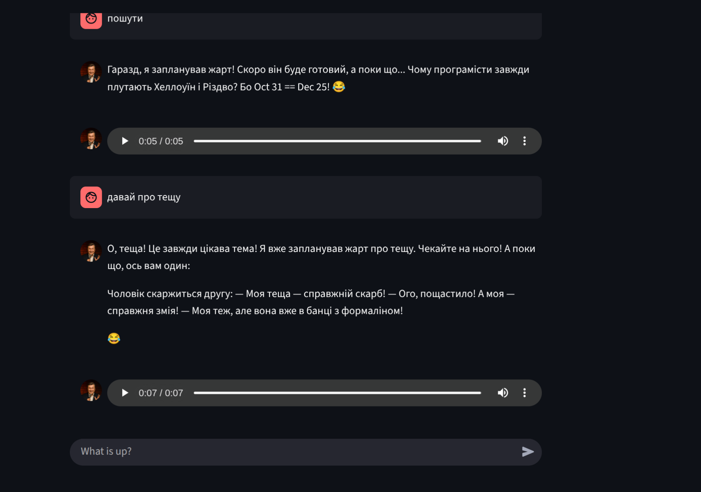
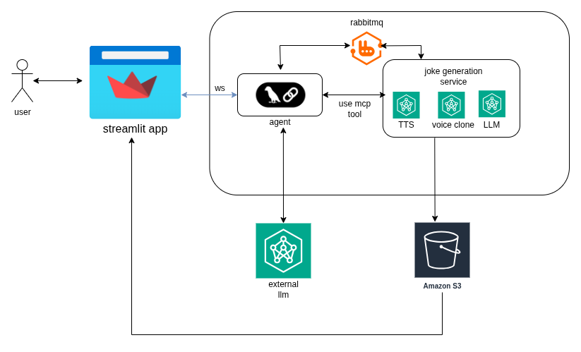

## not-a-legitimate-stand-up
Generate jokes voiced by famous criminal using (local) LLM and TTS models


[](https://raw.githubusercontent.com/ivanYatcuba/not-a-legitimate-stand-up/blob/main/demo_vid.mp4)


## app consist of modules
* agent
* legitimate-service-joke
* ui



### agent
Simple app with fastapi and lnggraph to receive messages va websockets and using llm and mcp server produce response

### legitimate-service-joke
Mcp server that provides tool to generate jokes

### ui
Streamlit app that sends user messages via websocket and displaces agent responses


## usage

install nvidia-container-toolkit for your os https://docs.nvidia.com/datacenter/cloud-native/container-toolkit/latest/install-guide.html

optionally fine tune your model. use train/train.ipynb

fill in all env variables in .env file. For description see .env.example

downoad required dependency models:
* fcpe.pt
* hubert_base.pt
* rmvpe.pt

put those models in the models/ directory

run ```docker-compose up```
